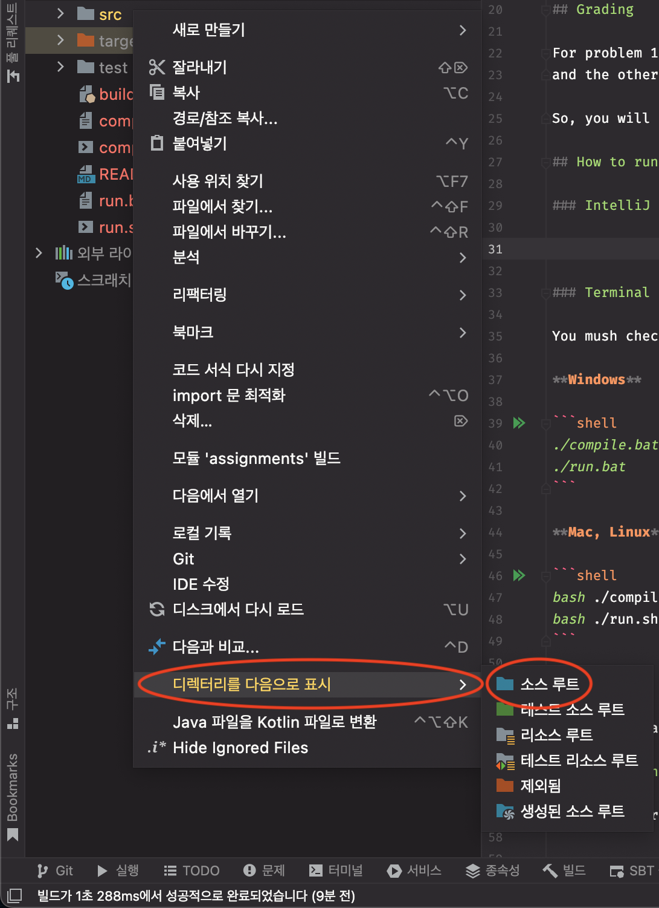

# Assignment 4: Programming Principles, SNU 4190.210

## Objective

This assignment is a training for the final project. 
You should implement an evaluator for the recursive function `f(x, y)`. 

Mainly, you should fill `TODO`s from `FnEvaluator`.
Since the value is expressed as an abstract value with the type classes, 
you should also write several instances of the given type classes. 

## Restrictions

**WARNING: Please read the restrictions below carefully.** 

If you do not follow it, **your submission will not be graded.**

1. Do not use the keyword `var` EXCEPT we have given. Use `val` and `def` instead.
2. Do not modify any `.scala` files without `???` and `TODO`. You can only replace `???` and `TODO` with your code.
3. **DO NOT USE TYPE CASTING METHODS** such as `.asInstanceOf` or `isInstanceOf`.

Target codes: `BinaryValImpl.scala`, `ImmValImpl.scala`, `FnEvaluator.scala`

You cannot modify the other codes except the above target codes.

Again, your score will be zero if you do not follow these rules.

## Grading 

We will run a lot of unit tests to test your code. 

Therefore, you should implement all the functions with `???` even they are not used from the given `Test.scala`.

## How to run

### IntelliJ IDEA

1. Open `hw4` directory from IntelliJ IDEA
2. Mark `src` folder as **Source root** like below

3. Mark `test` folder as **Test source root** by the same way.
4. Run `object Test extends App` from `test/hw3/Test.scala` to test your implementation.

### Terminal

You mush check that `scalac` and `scala` are runnable from your terminal.

**Windows**

```shell
./compile.bat
./run.bat
```

**Mac, Linux**

```shell
bash ./compile.sh
bash ./run.sh
```

## Q&A

If you have any questions, please submit an issue to [pp202202 issue tracker](https://github.com/snu-sf-class/pp202202/issues).

## Submissions

TBD

### How to submit

Compress `src` folder and submit compressed zip file.


